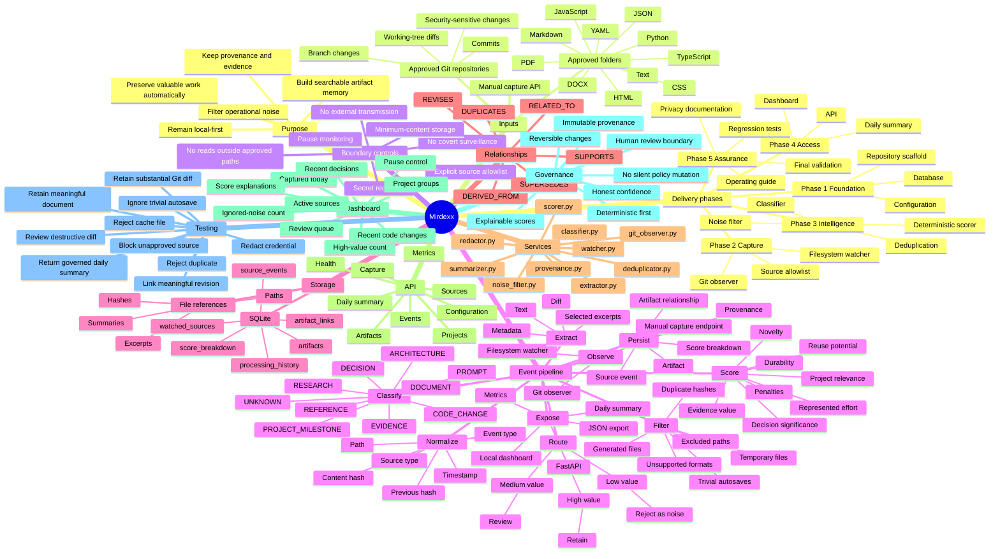
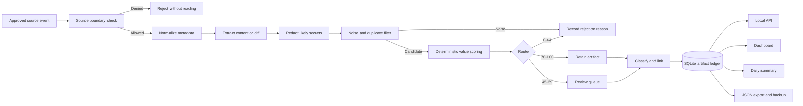
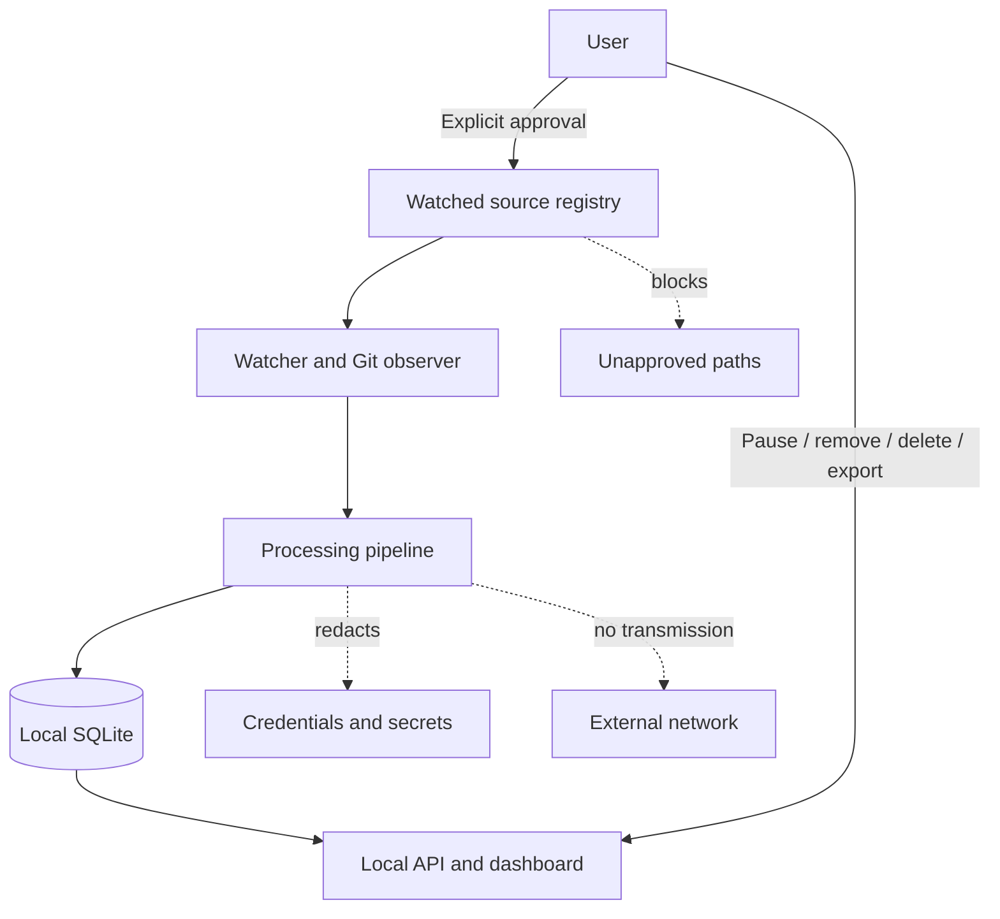

# Mirdexx Architecture Mind Map

This document gives OpenHands and future contributors a compact architectural view of Mirdexx before runtime implementation begins.

## System mind map



## Primary component flow



## Trust boundary model



## Architectural invariants

1. **No observation without explicit source approval.**
2. **No artifact without an explainable score or manual capture record.**
3. **No silent external transmission.**
4. **No covert monitoring features.**
5. **No inferred decision or milestone without source evidence and confidence.**
6. **No duplicate artifact when the content hash and provenance are unchanged.**
7. **No meaningful revision without a relationship to prior state when one exists.**
8. **No behavioral increment without regression evidence.**
9. **No claim of completion without runnable validation.**
10. **No probabilistic dependency in the MVP when deterministic logic is sufficient.**

## Initial repository target structure

```text
mirdexx/
├── README.md
├── pyproject.toml
├── .env.example
├── config/
│   └── mirdexx.example.yaml
├── app/
│   ├── main.py
│   ├── api/
│   ├── core/
│   ├── models/
│   ├── services/
│   │   ├── watcher.py
│   │   ├── git_observer.py
│   │   ├── extractor.py
│   │   ├── noise_filter.py
│   │   ├── scorer.py
│   │   ├── classifier.py
│   │   ├── deduplicator.py
│   │   ├── redactor.py
│   │   └── provenance.py
│   ├── templates/
│   └── static/
├── tests/
│   ├── fixtures/
│   ├── test_noise_filter.py
│   ├── test_scoring.py
│   ├── test_deduplication.py
│   ├── test_source_boundaries.py
│   ├── test_redaction.py
│   └── test_api.py
├── scripts/
│   ├── run_dev.py
│   └── export_artifacts.py
└── docs/
    ├── architecture-mindmap.md
    ├── architecture.md
    ├── privacy-boundaries.md
    ├── scoring-model.md
    └── operating-guide.md
```

## OpenHands handoff note

OpenHands should use this mind map together with the root README as the initial implementation contract.

The first bounded build increment should create only the project scaffold, configuration model, database bootstrap, and tests proving the source allowlist boundary. It should not add watchers, external AI services, cloud infrastructure, or hidden background persistence in the first increment.
