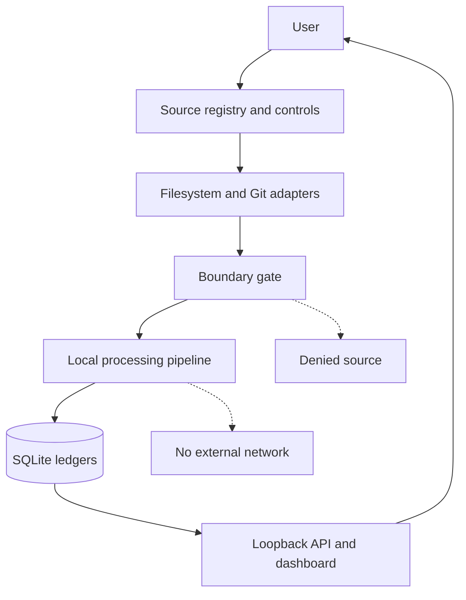

# Mirdexx System Architecture

**Status:** Draft architecture baseline  
**Version:** 0.1.0-architecture  
**Date:** 2026-07-21  
**Repository:** `dburt-proex/mirdexx`  
**Scope:** Local-first MVP architecture before runtime implementation

This document converts the Mirdexx vision and architecture mind map into explicit component boundaries, state transitions, data contracts, governance gates, and release criteria.

It is a design contract. It does not claim that the runtime has been implemented or that the acceptance tests currently pass.

## 1. Architecture verdict

Mirdexx is a **local-first, boundary-first artifact ledger**.

Its durable unit is not an activity log. Its durable unit is an explainable artifact record supported by source provenance and a processing decision.

The architecture is governed by six decisions:

1. **Approval precedes observation.** A source must be explicitly registered before Mirdexx may inspect it.
2. **Boundary checks precede content reads.** An unapproved path is rejected before content extraction.
3. **Capture and retention are separate decisions.** Observing an event does not make it an artifact.
4. **Deterministic processing comes first.** The MVP uses deterministic filters, scoring, classification rules, and redaction.
5. **The observation ledger and artifact ledger are separate.** Events preserve processing evidence; artifacts preserve durable work value.
6. **Review is a first-class route.** Medium-confidence, security-sensitive, destructive, or ambiguous candidates are not silently retained or discarded.

## 2. Purpose, goals, and non-goals

### Purpose

Answer one operational question with trustworthy local evidence:

> What valuable work did I create, change, decide, or preserve today?

### MVP goals

- Observe explicitly approved local folders and Git repositories.
- Normalize file and Git activity into a common event contract.
- Reject operational noise before it becomes durable state.
- Score candidates using an explainable 0–100 model.
- Preserve valuable artifacts, provenance, score rationale, and relationships.
- Route ambiguous or high-risk candidates to a local review queue.
- Expose the ledger through a loopback-only API and minimal dashboard.
- Provide daily summaries, JSON export, and database backup.
- Keep captured content local and redact likely credentials before persistence.

### Explicit non-goals

The MVP does not implement:

- keylogging;
- covert screenshots;
- microphone or webcam recording;
- unrestricted clipboard monitoring;
- browser-history collection;
- employee monitoring;
- email ingestion;
- cloud synchronization;
- external model calls;
- automatic publishing;
- automatic deletion;
- reads outside approved paths;
- hidden persistence;
- outbound transmission of captured content.

## 3. System context



MVP runtime components:

| Component | Responsibility | Authority |
|---|---|---|
| User control surface | Approve, pause, remove, review, export, and delete | Highest local authority |
| Source registry | Store allowed roots, repositories, filters, and custody policy | May authorize capture only |
| Capture adapters | Convert approved filesystem/Git observations into events | Read only; never choose sources |
| Boundary gate | Enforce source, path, pause, and event policy | May reject; may not expand scope |
| Processing pipeline | Extract, redact, filter, score, classify, and relate | May derive records; may not publish externally |
| SQLite storage | Preserve events, artifacts, decisions, and audit history | Local persistence only |
| API/dashboard | Query and perform explicit local control actions | No remote binding by default |

There is no cloud service, remote model, external connector, or public API in the MVP.

## 4. Trust boundary and permission model

### Source registration

A source definition must contain:

- stable source ID;
- source kind: `FOLDER`, `GIT_REPOSITORY`, or `MANUAL`;
- canonical approved root or repository path;
- enabled/paused state;
- include rules;
- exclude rules;
- content custody mode;
- policy version;
- created and updated timestamps.

The registry is the only authority that can make a source eligible for observation. A watcher cannot register a source, widen a path, or modify policy.

### Boundary check order

For every candidate observation:

1. Resolve the source ID.
2. Confirm the source exists and is enabled.
3. Confirm the source is not paused.
4. Canonicalize the observed path.
5. Confirm the path is within the approved canonical root.
6. Apply include and exclude rules.
7. Confirm the event type and file type are supported.
8. Assign the current policy version.
9. Only then permit content or diff extraction.

If any check fails, Mirdexx records a safe rejection reason and does not read file content.

### Content custody modes

| Mode | Processing behavior | Persisted content |
|---|---|---|
| `METADATA_ONLY` | Content may be inspected in memory for deterministic filtering and scoring | Path metadata, hashes, bounded metadata, score rationale |
| `REDACTED_EXCERPT` | Content is inspected and passed through redaction | Bounded redacted excerpts or diff excerpts |
| `FULL_CONTENT` | Not available in the MVP | None |

Mirdexx must never persist unredacted content. Raw content must not appear in logs, exception messages, metrics, or API responses.

### Local runtime boundary

- Bind the API to loopback by default.
- Do not include outbound network code in the MVP.
- Do not write outside the configured local data directory and approved export destinations.
- Require an explicit user action for pause, source removal, artifact deletion, and export.
- Record control actions in an append-only audit log.
- Treat configuration changes as policy changes with a new policy version.

## 5. Processing pipeline

```mermaid
flowchart TD
    R["Received metadata"] --> B{"Boundary allowed?"}
    B -->|No| RB["Rejected: boundary"]
    B -->|Yes| N["Normalize"]
    N --> E["Extract projection"]
    E --> S["Redact secrets"]
    S --> F{"Noise or duplicate?"}
    F -->|Yes| RN["Rejected: noise or duplicate"]
    F -->|No| V["Score candidate"]
    V --> Q{"Route"]
    Q -->|High value| T["Retain"]
    Q -->|Medium value or risk| H["Review queue"]
    Q -->|Low value| RL["Rejected: low value"]
    T --> C["Classify and relate"]
    H --> C
    C --> L[("Artifact ledger")]
```

### Event lifecycle

Event processing is monotonic except for bounded retry of retryable failures.

| State | Meaning | Terminal |
|---|---|---:|
| `RECEIVED` | Safe event metadata has entered the local ledger | No |
| `BOUNDARY_ALLOWED` | Source and path checks passed | No |
| `BOUNDARY_REJECTED` | Source or path was not eligible; content was not read | Yes |
| `NORMALIZED` | Common event fields and idempotency key exist | No |
| `EXTRACTED` | Metadata, text projection, or diff projection was produced | No |
| `REDACTED` | Likely credentials and sensitive tokens were removed from the projection | No |
| `REJECTED_NOISE` | Excluded, temporary, generated, trivial, or unsupported activity | Yes |
| `REJECTED_DUPLICATE` | Same content and provenance were already processed | Yes |
| `SCORED` | Explainable component scores and penalties were recorded | No |
| `RETAINED` | Candidate produced a durable artifact record | Yes |
| `REVIEW` | Candidate requires explicit local review | No |
| `REJECTED_LOW_VALUE` | Candidate scored below the retention threshold | Yes |
| `FAILED_RETRYABLE` | Processing failed for a recoverable reason | No |
| `FAILED_TERMINAL` | Processing failed and cannot be safely retried | Yes |

A review decision may transition an artifact to `RETAINED`, `REJECTED_LOW_VALUE`, or `DISMISSED`. User deletion is explicit, audited, and never automatic.

## 6. Canonical event contract

Every adapter emits the same normalized event shape:

```text
SourceEvent
  event_id: UUID
  source_id: UUID
  observed_at: UTC timestamp
  adapter: FILESYSTEM | GIT | MANUAL
  event_type: CREATE | MODIFY | DELETE | COMMIT | WORKTREE_DIFF | MANUAL_CAPTURE
  canonical_path: nullable absolute path
  source_ref: nullable Git commit, branch, or repository reference
  content_hash: nullable SHA-256
  previous_hash: nullable SHA-256
  size_bytes: nullable integer
  file_type: nullable enum
  event_metadata: JSON
  idempotency_key: string
  policy_version: string
  processing_state: enum
  failure_code: nullable string
```

Invariants:

- `event_id` is unique.
- `idempotency_key` is unique per source policy.
- Hashes are used for identity and deduplication, not as a substitute for provenance.
- Delete events retain metadata only; Mirdexx does not attempt to recreate deleted content.
- Event metadata is safe to persist before extraction.
- Adapter-specific fields remain inside `event_metadata`; domain services do not depend on adapter internals.

## 7. Component interfaces

The following boundaries are implementation contracts, not a requirement to use a particular Python library.

| Boundary | Input | Output | Must not do |
|---|---|---|---|
| Source registry | Source create/update request | Validated source definition | Read content or widen authority |
| Capture adapter | Approved source definition | Raw observation metadata | Select unapproved paths |
| Boundary gate | Observation and registry | Allow/reject decision with reason | Extract content before decision |
| Extractor | Allowed observation and custody mode | Redacted-ready projection | Persist raw content |
| Redactor | In-memory projection | Redacted projection and match metadata | Log matched secret values |
| Noise filter | Projection and policy | Keep/reject decision with reason | Mutate source files |
| Scorer | Candidate evidence | Score breakdown, confidence, explanation | Hide weighting or penalties |
| Classifier | Projection and event context | Artifact classification | Claim unsupported certainty |
| Relationship resolver | Candidate and prior artifacts | Explicit relationship proposals | Create silent destructive links |
| Ledger | Validated domain records | Durable local records | Transmit data externally |
| Summary service | Retained/reviewable artifacts | Deterministic daily summary | Include rejected noise as work |

Suggested service contracts:

```python
observe(source) -> Iterable[Observation]
authorize(observation, registry) -> BoundaryDecision
extract(observation, custody_mode) -> ContentProjection
redact(projection) -> RedactedProjection
filter(projection, policy) -> FilterDecision
score(candidate, policy) -> ScoreDecision
classify(candidate) -> ClassificationDecision
relate(candidate, prior_artifacts) -> list[RelationshipProposal]
persist(event, projection, decisions) -> PersistenceResult
```

## 8. Deterministic decision logic

### Eligibility gates

A candidate cannot be scored unless:

- the source is approved and active;
- the canonical path is within the source boundary;
- the event type is supported;
- the path is not excluded;
- the file type is supported or the event is a supported Git event;
- the content hash is new or the provenance represents a meaningful revision.

### Noise filters

Default rejection rules include:

- `.git/`;
- `node_modules/`;
- virtual environments;
- cache and test output;
- build and distribution output;
- temporary, swap, and autosave files;
- files beginning with `~$`;
- unchanged content hashes;
- generated dependency churn without meaningful source changes;
- trivial edits below the configured change threshold.

Every rejection stores a machine-readable reason and human-readable explanation.

### Value score

The initial score remains the README contract:

| Dimension | Maximum |
|---|---:|
| Novelty | 20 |
| Project relevance | 20 |
| Durability | 15 |
| Evidence value | 15 |
| Reuse potential | 15 |
| Decision significance | 10 |
| User effort represented | 5 |
| **Total** | **100** |

Penalties:

| Condition | Penalty or action |
|---|---:|
| Duplicate or near duplicate | -30 |
| Temporary or generated file | -30 |
| Trivial edit | -20 |
| Unsupported file type | -20 |
| Excluded path | Reject before scoring |

Default routes:

- `70–100`: retain;
- `45–69`: review;
- `0–44`: reject as noise/low value.

The stored score must include component values, penalties, evidence signals, confidence, policy version, final route, and explanation.

### Safety and ambiguity overrides

The score does not override safety gates:

- destructive Git changes route to `REVIEW`;
- authentication, authorization, secret, permission, or deployment-sensitive changes route to `REVIEW`;
- credential-like values are redacted before persistence and flagged;
- source-boundary failures are rejected without content reads;
- uncertain project assignment remains unassigned or enters review;
- unsupported classification uses `UNKNOWN`, never a fabricated label.

### Classification

Classification is rule-first:

```text
Git diff or commit -> CODE_CHANGE
Architecture/design source signals -> ARCHITECTURE
Decision record or explicit decision language -> DECISION
Research notes with cited evidence -> RESEARCH
Prompt or instruction asset -> PROMPT
Evidence, fixture, or validation record -> EVIDENCE
Milestone or release record -> PROJECT_MILESTONE
Supported durable reference -> REFERENCE
Otherwise -> UNKNOWN
```

Classification may be corrected by the user. Corrections are audited and do not rewrite the original event decision.

## 9. Artifact contract and relationships

A retained or reviewable candidate produces an artifact record with:

- artifact ID;
- originating event ID;
- title;
- artifact type;
- project ID or explicit unassigned state;
- source ID and canonical path;
- content hash;
- version or revision marker;
- value score;
- confidence;
- route/status;
- redaction metadata;
- provenance;
- tags;
- created and updated timestamps.

Initial relationships:

- `REVISES`
- `SUPPORTS`
- `DERIVED_FROM`
- `DUPLICATES`
- `RELATED_TO`
- `SUPERSEDES`

A relationship is only created when its source and target are identifiable. Relationship proposals with low confidence enter review.

## 10. SQLite persistence model

The MVP should use SQLite with foreign keys enabled and explicit schema migrations.

| Table | Purpose | Key controls |
|---|---|---|
| `watched_sources` | Approved source definitions | Canonical path, enabled/paused state, custody mode, policy version |
| `projects` | Optional project grouping | Explicit user mapping; no silent assignment |
| `source_events` | Append-only observation and processing evidence | Unique event and idempotency keys; no raw content |
| `event_projections` | Redacted bounded extraction | Redacted fields only; custody mode enforced |
| `artifacts` | Durable retained/reviewable work records | Status transition rules; provenance required |
| `score_breakdowns` | Explainable scoring decision | Component scores, penalties, evidence, explanation |
| `artifact_links` | Version and evidence relationships | Valid source/target IDs and relationship type |
| `processing_attempts` | Failure and retry evidence | Stage, timestamp, safe error code |
| `control_audit` | User and policy actions | Append-only actor, action, target, and timestamp |

Required integrity rules:

- foreign-key enforcement is enabled at connection time;
- source events are append-only;
- control audit entries are append-only;
- no table stores unredacted content;
- duplicate detection uses source, content hash, and provenance;
- policy version is stored with every processed event;
- status transitions are validated in the domain layer;
- database errors fail closed and never trigger an automatic destructive repair.

## 11. API and dashboard boundary

The API is local control and query infrastructure, not an external service.

### MVP endpoints

| Method | Endpoint | Purpose |
|---|---|---|
| GET | `/health` | Runtime and database health |
| GET | `/config` | Safe configuration summary |
| POST | `/sources` | Add an explicitly approved source |
| GET | `/sources` | List registered sources |
| PATCH | `/sources/{id}` | Pause, resume, or update source policy |
| POST | `/capture` | Explicit manual capture |
| GET | `/events` | Inspect processing history |
| GET | `/artifacts` | Query retained and reviewable artifacts |
| GET | `/artifacts/{id}` | Inspect artifact and provenance |
| PATCH | `/artifacts/{id}` | Correct classification, project, tags, or review state |
| GET | `/projects` | List project groupings |
| GET | `/daily-summary` | Return retained/reviewable daily work |
| GET | `/metrics` | Safe operational counts |
| POST | `/export` | Explicit JSON export and backup request |

The dashboard must show:

- active and paused sources;
- captured, retained, review, and rejected counts;
- recent artifacts;
- review reasons;
- score explanations;
- provenance and source path;
- pause control;
- export and backup controls.

The daily summary must exclude rejected events and must distinguish retained artifacts from items awaiting review.

## 12. Failure handling and recovery

| Failure | Required behavior | Recovery |
|---|---|---|
| Source not approved | Reject before content read | User registers source |
| Path escapes canonical root | Reject and audit reason | Correct source configuration |
| File disappears during extraction | Preserve metadata event; mark retryable or terminal | Retry only while source remains approved |
| Permission denied | Preserve safe error; no content in logs | User corrects local permission |
| Unsupported format | Reject with reason | Add a reviewed extractor later |
| Duplicate/out-of-order event | Use idempotency key and hash/provenance checks | Mark duplicate; retain original |
| Secret pattern detected | Redact in memory, persist no raw value, flag | User reviews candidate if otherwise valuable |
| Database unavailable | Do not retain content in an unapproved fallback store | Retry metadata ingress later |
| Processing exception | Record stage and safe error code | Bounded retry for retryable failures |
| Invalid migration | Halt startup before mutating data | User repairs or rolls back migration |
| Policy change | Create a new policy version | Process new events under new policy; preserve history |

Mirdexx must fail closed at authority boundaries and fail visibly at processing boundaries.

## 13. Testing and acceptance criteria

The architecture is ready for runtime implementation when the first scaffold increment can prove:

1. approved source registration creates a validated source definition;
2. an unapproved path is rejected before extractor invocation;
3. a symlinked path outside the approved root is rejected;
4. a generated cache file is rejected with a reason;
5. an unchanged content hash is rejected as a duplicate;
6. a meaningful document is retained or routed according to its score;
7. a substantial Git diff is classified as `CODE_CHANGE`;
8. destructive or security-sensitive diffs route to review regardless of score;
9. credential-like values do not appear in persisted projections, logs, or API output;
10. a meaningful revision links to the prior artifact;
11. rejected noise does not appear in the daily summary;
12. a source pause prevents new processing;
13. JSON export contains provenance and score rationale;
14. restart recovery reprocesses safe uncompleted event metadata without duplicating artifacts.

Required test layers:

- domain unit tests for boundaries, filters, scoring, redaction, classification, and state transitions;
- storage integration tests for constraints, migrations, idempotency, and restart recovery;
- API tests for local control actions and safe response content;
- fixture-based regression tests for the acceptance cases above;
- privacy tests that scan logs and stored projections for prohibited raw values.

## 14. Build sequence

Each increment must be independently testable and reversible.

| Increment | Scope | Exit evidence |
|---|---|---|
| 1. Foundation | Package scaffold, configuration, SQLite bootstrap, source model, boundary service | Boundary and schema tests pass |
| 2. Event ledger | Normalized event contract, metadata ingress, processing states, audit records | Idempotency and state tests pass |
| 3. Projection pipeline | File metadata, supported extraction, redaction, noise filtering | Privacy and noise fixtures pass |
| 4. Intelligence | Deterministic scoring, routing, classification, deduplication, relationships | Score and relation fixtures pass |
| 5. Git observer | Commits, meaningful diffs, sensitive-change review override | Git regression fixtures pass |
| 6. Access surface | Loopback API, dashboard, daily summary, export | API and summary tests pass |
| 7. Release assurance | Documentation, privacy guide, operating guide, full regression run | All acceptance criteria pass |

The first implementation increment must stop after the foundation and boundary tests. It must not add watchers, model calls, cloud services, dashboards, or background persistence yet.

## 15. Architecture invariants

1. No observation without explicit source approval.
2. No content read before a successful boundary check.
3. No unredacted content in durable storage, logs, metrics, or API output.
4. No automatic external transmission.
5. No artifact without provenance and an explainable decision.
6. No silent duplicate when content and provenance are unchanged.
7. No meaningful revision without a prior-state relationship when one exists.
8. No security-sensitive or destructive change bypasses review.
9. No policy change without a new policy version and audit record.
10. No automatic deletion or publishing.
11. No probabilistic dependency where deterministic logic is sufficient for the MVP.
12. No completion claim without runnable validation evidence.

## 16. Recorded architecture decisions

| ID | Decision | Status |
|---|---|---|
| MX-ARCH-001 | Mirdexx is local-first and has no cloud or external model dependency in MVP | Accepted baseline |
| MX-ARCH-002 | Source allowlisting and boundary checks are enforced before content extraction | Accepted baseline |
| MX-ARCH-003 | Observation events and durable artifacts use separate ledgers | Accepted baseline |
| MX-ARCH-004 | Deterministic scoring and rule-first classification govern MVP routing | Accepted baseline |
| MX-ARCH-005 | `METADATA_ONLY` is the safest default custody mode; redacted excerpts require explicit source policy | Accepted baseline |
| MX-ARCH-006 | Medium-value, ambiguous, destructive, and security-sensitive candidates enter review | Accepted baseline |
| MX-ARCH-007 | The first build increment is foundation plus boundary tests only | Accepted baseline |

### Decisions still requiring review

- supported operating systems and filesystem notification backend;
- exact database migration library;
- final license;
- whether the dashboard should remain server-rendered or use a minimal client bundle;
- the threshold for near-duplicate similarity after exact-hash deduplication;
- whether future model-assisted summaries are permitted under a separately approved architecture.

These decisions do not block the foundation scaffold if the current invariants remain unchanged.

## 17. Handoff contract

OpenHands or another implementation agent must:

- read this document and the root README before changing code;
- implement one increment at a time;
- preserve the listed invariants;
- add regression tests with every behavior change;
- avoid unrelated refactors;
- report files changed, tests run, privacy impact, limitations, rollback path, and next increment;
- stop and request review when a change expands observation scope, custody, network access, automation authority, or public exposure.

