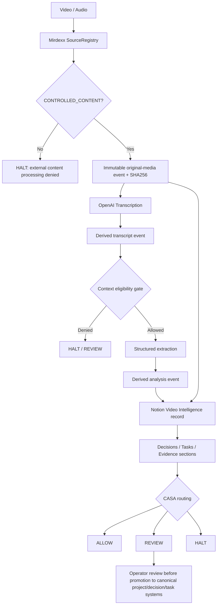

# Mirdexx Media Intelligence v0.1

## Purpose

Convert operator-authorized audio/video into provenance-bound transcripts and structured operating intelligence, publish the result to Notion, and route material actions toward CASA without making the model an authority source.



## Boundaries

- **Mirdexx owns provenance and custody.** Original media is hashed before derived artifacts are created.
- **OpenAI transcription is a processor, not an authority.** Standard, timestamped, and diarized modes normalize into one transcript contract.
- **Transcript text is untrusted data.** Commands spoken or embedded in media are never treated as system instructions.
- **CASA remains the authorization authority.** This component only proposes routing and derived records.
- **Notion is the operational presentation/index layer.** Mirdexx event IDs and SHA256 values preserve traceability outside Notion.

## Modes

| Mode | Default model | Output |
|---|---|---|
| `standard` | `gpt-4o-transcribe` | full transcript |
| `timestamped` | `whisper-1` | segment timestamps |
| `diarized` | `gpt-4o-transcribe-diarize` | speaker-attributed segments |

Model IDs are environment-configurable.

## Setup

```bash
python -m pip install -e ".[dev]"
cp .env.example .env
```

Set `OPENAI_API_KEY` and `NOTION_API_KEY` in the runtime environment. Never commit them.

## Register an authorized media root

```bash
mirdexx-media register-root ~/Media/AI-Inbox --db ~/.mirdexx/mirdexx.db --include "**/*.m4a" --include "**/*.mp4"
```

This creates a `CONTROLLED_CONTENT` source. Only paths inside the approved root and include/exclude policy may be read.

## Ingest

```bash
mirdexx-media ingest ~/Media/AI-Inbox/session.m4a \
  --db ~/.mirdexx/mirdexx.db \
  --source-id <SOURCE_ID> \
  --mode diarized \
  --project CASA \
  --data-policy Internal
```

To validate provenance/transcription/analysis without publishing to Notion:

```bash
mirdexx-media ingest <FILE> --source-id <SOURCE_ID> --no-notion
```

## Notion record contract

Database: **Video Intelligence**

Each record includes media, status, source hash, Mirdexx event ID, transcription model/mode, project reference, data policy, derived counts, and CASA routing. Page content contains:

1. Original media embed
2. Transcript
3. Summary
4. Decisions
5. Tasks
6. Evidence
7. CASA routing rationale
8. Provenance receipt

## Human review gate

V0.1 deliberately does **not** write extracted decisions/tasks into an existing canonical Projects, Tasks, or Decision Ledger database. The workspace currently contains multiple project surfaces; silently choosing one would create source-of-truth ambiguity.

`REVIEW` is required before enabling promotion adapters that mutate those canonical systems. The media record and Mirdexx events remain complete without that promotion.

## Failure behavior

- Path outside registered root → HALT before read.
- Custody other than `CONTROLLED_CONTENT` → HALT before external transmission.
- Unknown/untrusted/quarantined event → denied model context.
- OpenAI failure → no fabricated transcript; Notion is not marked analyzed.
- Structured extraction failure → transcript remains provenance-bound, analysis is not published as complete.
- Notion failure → Mirdexx events remain canonical and retryable.
- Embedded transcript instruction/prompt injection → treated as data; never executed.

## Acceptance criteria

- [ ] Existing Mirdexx tests remain green.
- [ ] `CONTROLLED_CONTENT` migration preserves existing source records and foreign-key integrity.
- [ ] `.m4a`, `.mp3`, `.mp4`, `.wav`, `.webm` paths are accepted by the transcription adapter where supported by the upstream API.
- [ ] Original media event is SHA256-bound before transcription.
- [ ] Transcript is stored as a derived Mirdexx event.
- [ ] Context eligibility is enforced before structured analysis.
- [ ] Decisions, tasks, evidence, and CASA route are schema-valid structured output.
- [ ] Original media is uploaded/embedded in the Notion record.
- [ ] Transcript and provenance are readable on the Notion record.
- [ ] No secret values are committed.
- [ ] Live smoke test succeeds with one operator-approved recording.
