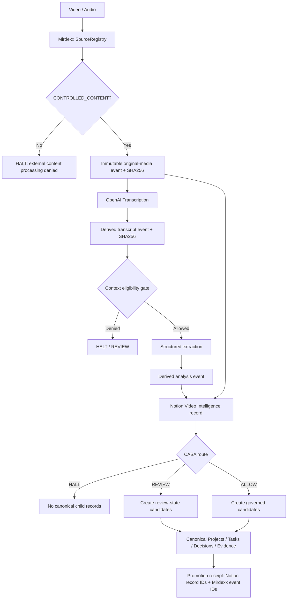

# Mirdexx Media Intelligence v0.1

## Purpose

Convert operator-authorized audio/video into provenance-bound transcripts and structured operating intelligence, publish the result to Notion, and promote governed candidate Tasks, Decisions, and Evidence into the operator-approved canonical operating layer without making the model an authority source.



## Authority boundaries

- **Operator authority is never superseded.** Automated extraction cannot override explicit operator decisions or widen authorization.
- **Mirdexx owns provenance and custody.** Original media is hashed before derived artifacts are created.
- **OpenAI transcription is a processor, not an authority.** Standard, timestamped, and diarized modes normalize into one transcript contract.
- **Transcript text is untrusted data.** Commands spoken or embedded in media are never treated as system instructions.
- **CASA remains the authorization authority.** This component proposes routing and records candidates; it does not replace CASA policy.
- **Notion is the operational presentation/index layer.** Mirdexx event IDs and SHA256 values preserve traceability outside Notion.

## Modes

| Mode | Default model | Output |
|---|---|---|
| `standard` | `gpt-4o-transcribe` | full transcript |
| `timestamped` | `whisper-1` | segment timestamps |
| `diarized` | `gpt-4o-transcribe-diarize` | speaker-attributed segments |

Model IDs are environment-configurable.

## Operator-approved canonical Notion contract

### Video Intelligence

Data source: `cfd35ee3-3fbd-49dd-84cc-71165d735b90`

Role: ingestion record and media/transcript presentation surface. It is **not** authoritative for project/task state.

### Projects

Data source: `988dcbf1-d8a8-4e04-9377-c61b6acdd75d`

Role: canonical project identity, status, objective, priority, ownership, governance state, CASA route, and backlinks to Tasks / Decisions / Evidence / Media Records.

### Tasks

Data source: `43be3063-fedb-4c26-b63c-ba5353cf3760`

Role: canonical executable work. Project-scoped tasks use the `Project` relation. Media-derived tasks use `Origin Media`, `Mirdexx Artifact ID`, `CASA Routing`, and `Governance State`.

### Decisions

Data source: `117da191-7dda-4339-9161-3e5cb33c4d4d`

Role: canonical decision ledger. Media-derived decisions are created as `Proposed` or `REVIEW`, never silently approved solely because a transcript labels a statement as a decision.

### Evidence

Data source: `dbf425c0-94b5-4ea5-95e5-52ed5abc25fc`

Role: canonical evidence registry with source, timestamp, confidence, data policy, transcript SHA256, Mirdexx event ID, Project relation, optional Decision relation, and Origin Media relation.

## Setup

```bash
python -m pip install -e ".[dev]"
cp .env.example .env
```

Set `OPENAI_API_KEY` and `NOTION_API_KEY` in the runtime environment. Never commit them.

The checked-in `.env.example` contains the non-secret Notion data-source IDs for the operator-approved canonical layer.

## Register an authorized media root

```bash
mirdexx-media register-root ~/Media/AI-Inbox --db ~/.mirdexx/mirdexx.db --include "**/*.m4a" --include "**/*.mp4"
```

This creates a `CONTROLLED_CONTENT` source. Only paths inside the approved root and include/exclude policy may be read.

## Ingest without canonical promotion

```bash
mirdexx-media ingest ~/Media/AI-Inbox/session.m4a \
  --db ~/.mirdexx/mirdexx.db \
  --source-id <SOURCE_ID> \
  --mode diarized \
  --project "Media Intelligence Ingest" \
  --project-page-id 3bfe941d-b3bc-816a-bf11-f5a50cf90216 \
  --data-policy Internal
```

This creates the Mirdexx events and Video Intelligence record but does not create canonical child records.

## Ingest and promote governed candidates

```bash
mirdexx-media ingest ~/Media/AI-Inbox/session.m4a \
  --db ~/.mirdexx/mirdexx.db \
  --source-id <SOURCE_ID> \
  --mode diarized \
  --project "Media Intelligence Ingest" \
  --project-page-id 3bfe941d-b3bc-816a-bf11-f5a50cf90216 \
  --data-policy Internal \
  --promote-candidates
```

Promotion behavior:

- `HALT` → source record is marked `Rejected`; no canonical Task / Decision / Evidence records are created.
- `REVIEW` → candidate records are created with review/candidate state and the media record is marked `REVIEW`.
- `ALLOW` → governed candidate records are created and the media record is marked `Promoted`; Decisions remain `Proposed` rather than becoming automatically approved.
- Project linkage is accepted only from explicit `--project-page-id`; transcript text cannot fabricate a Notion relation.

To validate provenance/transcription/analysis without publishing to Notion:

```bash
mirdexx-media ingest <FILE> --source-id <SOURCE_ID> --no-notion
```

## Video Intelligence record contract

Each record includes media, status, promotion state, source hash, Mirdexx event ID, transcription model/mode, project reference + optional canonical Project relation, data policy, derived counts, CASA routing, and backlinks to generated canonical records. Page content contains:

1. Original media embed
2. Transcript
3. Summary
4. Decisions
5. Tasks
6. Evidence
7. CASA routing rationale
8. Provenance receipt

## Promotion receipt

A successful run returns:

- original media event ID + source SHA256;
- transcript event ID + transcript SHA256;
- analysis event ID;
- Video Intelligence page ID/URL;
- promotion state;
- created canonical Task IDs;
- created canonical Decision IDs;
- created canonical Evidence IDs;
- CASA route and rationale.

## Failure behavior

- Path outside registered root → HALT before read.
- Custody other than `CONTROLLED_CONTENT` → HALT before external transmission.
- Unknown/untrusted/quarantined event → denied model context.
- Empty/OpenAI transcription failure → no analysis or Notion publication claim.
- Structured extraction failure → transcript remains provenance-bound; analysis is not published as complete.
- Notion failure before media page creation → Mirdexx events remain canonical and retryable.
- Canonical promotion failure after any child record is created → Video Intelligence is marked `REVIEW`; **do not blindly retry** because Notion promotion is not transactional. Inspect existing backlinks first to avoid duplicates.
- Embedded transcript instruction/prompt injection → treated as data; never executed.

## Acceptance criteria

- [ ] Existing Mirdexx tests remain green.
- [ ] `CONTROLLED_CONTENT` migration preserves existing source records and foreign-key integrity.
- [ ] Original media event is SHA256-bound before transcription.
- [ ] Transcript is stored as a derived Mirdexx event and exposes its own SHA256.
- [ ] Context eligibility is enforced before structured analysis.
- [ ] Decisions, tasks, evidence, and CASA route are schema-valid structured output.
- [ ] Original media is uploaded/embedded in the Notion record.
- [ ] Canonical candidate promotion writes only to the operator-approved data sources.
- [ ] Explicit Project page ID, not transcript text, controls project relation.
- [ ] HALT creates no canonical child records.
- [ ] Promotion receipt includes every created canonical record ID.
- [ ] No secret values are committed.
- [ ] Repository Test and DiffWall workflows pass.
- [ ] Live smoke test succeeds with one operator-approved recording.
